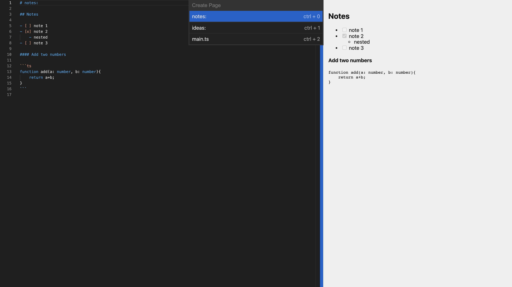

# Refline

A keyboard-first note editor. Pages look like plain markdown on the surface — underneath, every page and every line is a JSON block, stored as [JSON Lines](https://jsonlines.org/).



## Why

Most note apps hide your notes in a database. Refline flips that: your notes are
inspectable, appendable JSON — one object per line — living in `localStorage`:

```jsonl
{"_id":"p1","type":"page","lines":["p1l0","p1l1","p1l2"]}
{"_id":"p1l0","type":"line","page":"p1","content":"# notes:","tokens":["notes"],"ref":[]}
{"_id":"p1l1","type":"line","page":"p1","content":"plain text on the surface","tokens":[],"ref":[]}
```

A page is just an ordered list of line ids. A line knows its content, the tokens it
contains, and the `$ref` links pointing at it. That structure is what powers the
editor features below — and makes the store queryable (see the GraphQL experiment).

## Features

- **Command palette** — `Ctrl+P` to create a page or jump to an existing one; fuzzy-filtered, keyboard-driven.
- **Pages are born from a heading** — the first line names the page: `# notes:`, `// main.ts`, `<!-- index.html -->`. Press Enter after the heading and the page opens or gets created.
- **Per-page language detection** — the Monaco mode switches with the page name (`*.ts` → TypeScript, `*.js` → JavaScript, `*.svelte`/`*.html` → HTML, `schema`/`graphql` → GraphQL, everything else → markdown). A `#!lang` hint in the buffer overrides it.
- **Cross-page `$ref()` autocomplete** — a completion provider suggests tokens seen anywhere in your notes; accepting one inserts a `$ref(lineId, token)` link, which resolves back to the token text and is recorded on the line's block.
- **Live markdown preview** — split view with rendered preview (checkboxes, nested lists, fenced code blocks) for markdown pages.
- **Keyboard-first** — `Ctrl+P` palette, `Ctrl+Alt+N` new page, `Ctrl+Delete` delete the current page.

Every fresh session opens with a sample note so there's something to poke at.

## Getting started

```bash
npm install
npm run dev      # http://localhost:8080
npm run build    # production bundle → public/build
```

Built with Svelte 3, TypeScript, Monaco Editor and webpack.

## How it works

- [`src/Pages.ts`](src/Pages.ts) is the core: a block store (`insertBlock`, `patchBlock`, `removeBlock`), page insert/patch with line-level diffing ([fast-diff](https://github.com/jhchen/fast-diff)), page-name parsing, and the Monaco completion provider.
- When you edit a page, the buffer is diffed against the stored lines and only changed lines are patched — the JSON Lines store stays tight.
- [`src/components/Editor.svelte`](src/components/Editor.svelte) wraps Monaco; [`src/components/CommandPalette.svelte`](src/components/CommandPalette.svelte) is the palette; [`src/components/MarkdownPreview.svelte`](src/components/MarkdownPreview.svelte) renders the preview.

## GraphQL over JSON Lines (experiment)

[`graphql/Graphql.js`](graphql/Graphql.js) is a small, hand-rolled GraphQL query parser and
resolver runner — no dependencies — written to query the block store the way you'd query
a database. See [`public/schema.graphql`](public/schema.graphql) for the schema shape it
targets. Experimental, but a fun look at where the data model was heading.

## License

[MIT](LICENSE) © Sameer Tariq
